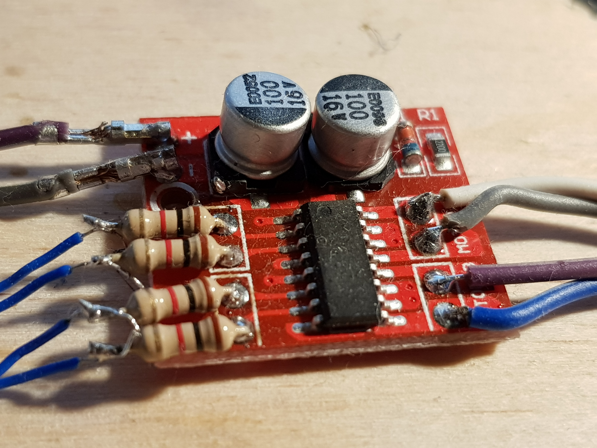
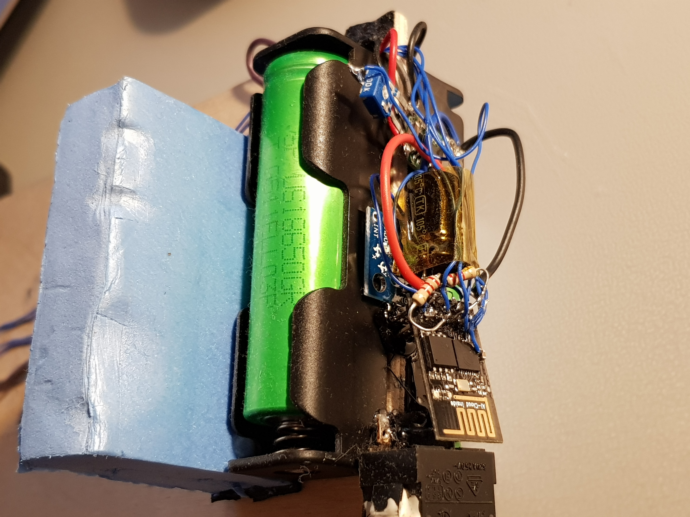
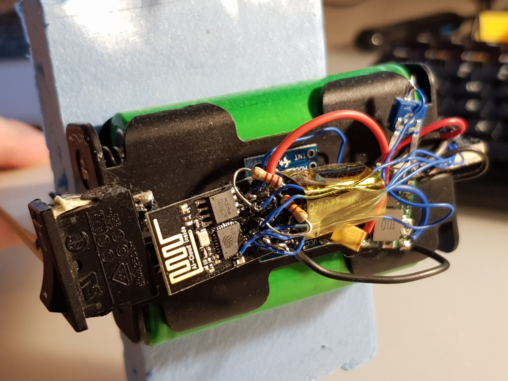
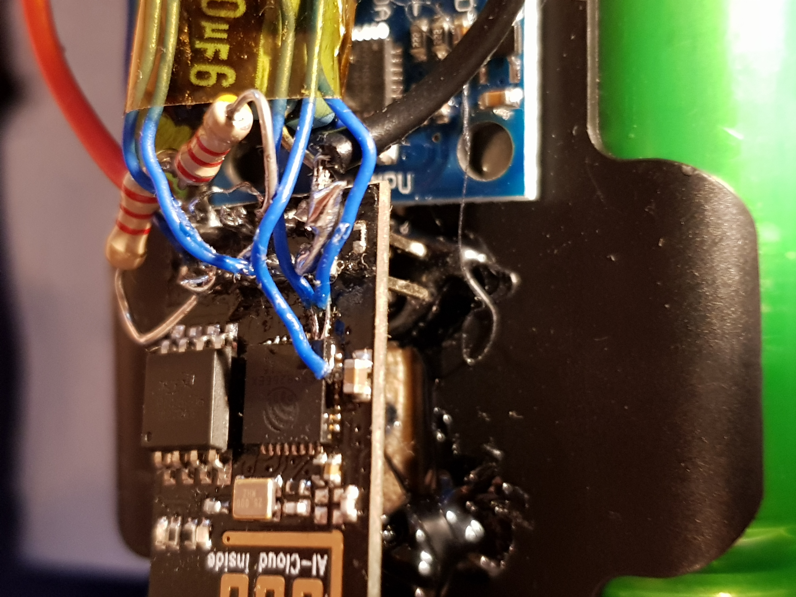

# ESPBalancingRobot
ESP8266 ESP-1 WiFi Balancing robot

Originally the robot was built using Arduino pro mini and all it could do was balance. I was thinking to add BT module to control it until I discovered that I have ESP8266 lying around. Also I decided to use a better IMU algorithm instead of DPU of the MPU6050.
Thus the ESPBalancingRobot was born.


# Configuration before Building
Before building and uploading please create `wificonfig.h` file with the following contents:
```
#define WIFI_SSID        "ssid"
#define WIFI_PASSWORD    "password"
#define ARDUINO_HOSTNAME "hostname"
```

If you fork the repo, you can still have this file as it is in `.gitignore` and won't be added during commit.

# Building and flashing

PlatformIO was used to develop the code, therefore the structure of the project conforms to what PlatformIO expects.
Flash the ESP module first before soldering anything. Also upload SPIFFS.
After that it is possible to use OTA, just don't forget to configure ESP to connect to your local network.
You can start assembling the robot.

# Construction


## Wheel base

Wheel base consists of two geared motors, some scrap wheels and a 3D printed motor holder which is basically a tube with slots
to hold wooden sheet. Later I added pads so that the robot wouldn't suffer much after falling over.


## Motor controller

I used a 1A motor controller based on L293, however chinese manufacturers seemed to be too secretive about the chip used... Even though they advertise it as L293 motor controller board on ebay :)



## Electronics
The robot is powered by two LiIon batteries salvages from old laptop battery. There is a dc-dc buck converter that supplies 3.3V for electronics, some random power switch, ESP-1 module and an MPU6050 board. Also some pullups, capacitors and a trim potentiometer for battery monitoring (turned down to 1:10 ratio).



IMU was used a simple MPU6050 and can be seen under the ESP module. It is glued by hot glue to the battery holder. Alignment is not perfect, but staged PID adjusts for that.



## The ESP-1 module

For robot control we need six pins(not counting ADC pin for battery monitoring): 2x for I2C, 4x for PWM control.
As ESP-1 module clearly doesn't have enough pins we need to add those. With a steady hand, small soldering iron, some flux and good eyes it is possible to solder those additional ports directly to the ESP chip pins.



I used RX/TX pins for I2C as the chip emits some noise on those pins while booting and MPU doesn't seem to be upset about that. Although the motors might be.

Also I had to add pullUP resistors to GPIO0 and GPIO2 and a beafy capacitor on the 3.3V rail.

One thing to mention about the motors. For some reason one of my motor drivers and ESP modules during the early stages of the build just died on me. I figured that it had something to do with cheap motor driver burnup. So this time I added 1k resistors in series just to be safe.

# Theory of operation

Mostly inspired by `https://www.reddit.com/r/esp8266/comments/5pqri1/espway_a_selfbalancing_robot_powered_by_esp8266/`.

# PID tuning

It is possible to tune PID controllers by building the firmware with

```
#define USE_LOGGING 1
```

somewhere in the beginning of the code.
The UI changes somewhat and allows to see the realtime graphs of speed/angle values and also provides some sliders to set pid values.
There are some issues, though with the ESPUI, as if I add all the controllers (for both PIDs), the ESP crashes. Also adding all the desired controls consumes to much flash size so the OTA doesn't allow to flash due to size limitations.
